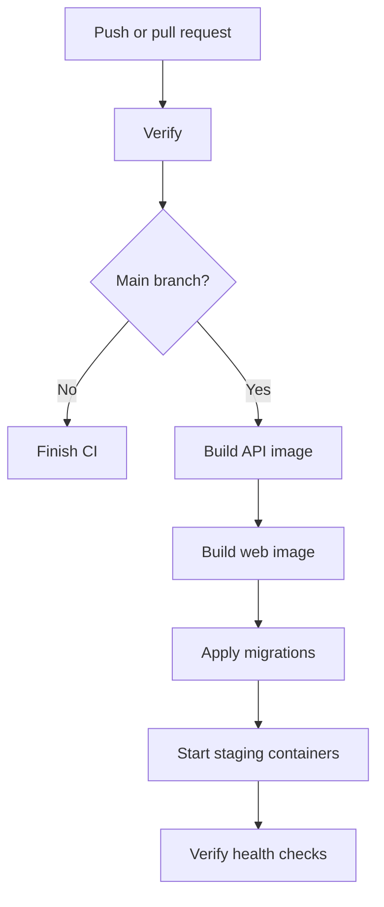

# DS-HR

[](https://github.com/DigitalShovel/DS-HR/actions/workflows/ci.yml)

Digital Shovel’s internal asynchronous video-interviewing platform.

This repository currently represents **Clean Milestone 0**: a tested technical foundation with local development, automated verification, private-storage readiness, Docker configuration, and automatic AWS staging deployment.

## Technology stack

| Component     | Technology                           |
| ------------- | ------------------------------------ |
| Frontend      | Next.js 16, React 19, TypeScript     |
| API           | NestJS 11, TypeScript                |
| Database      | PostgreSQL 17                        |
| ORM           | Prisma 6                             |
| Storage       | Local filesystem / private Amazon S3 |
| Containers    | Docker Compose                       |
| Reverse proxy | Nginx                                |
| CI/CD         | GitHub Actions                       |
| Staging host  | Amazon EC2                           |

## Repository structure


## Requirements

Install the following before running the project locally:

* Node.js 24+
* npm 10+
* Docker Desktop
* Git

## Local setup

From the repository root:

```powershell
Copy-Item .env.example .env
npm ci
docker compose up -d postgres
npm run db:generate
npm run db:deploy
npm run verify
npm run dev
```

Open:

* Frontend: http://localhost:3000
* API root: http://localhost:4000/api
* Liveness: http://localhost:4000/api/health/live
* Readiness: http://localhost:4000/api/health/ready
* API documentation: http://localhost:4000/api/docs

## Daily development

Start PostgreSQL:

```powershell
docker compose up -d postgres
```

Start the API and frontend:

```powershell
npm run dev
```

Stop the local containers when finished:

```powershell
docker compose down
```

The PostgreSQL data remains stored in its named Docker volume.

## Verification

Run the complete local verification suite:

```powershell
npm run verify
```

This performs:

1. Prisma client generation
2. ESLint checks
3. API type-checking
4. Frontend type-checking
5. API tests
6. NestJS production build
7. Next.js production build

## Database commands

Generate the Prisma client:

```powershell
npm run db:generate
```

Create a development migration:

```powershell
npm run db:migrate
```

Apply existing migrations:

```powershell
npm run db:deploy
```

Open Prisma Studio:

```powershell
npm run db:studio
```

There is intentionally no database seed command in Milestone 0.

## Health checks

The API exposes two health endpoints.

### Liveness

```text
GET /api/health/live
```

Confirms that the API process is running.

### Readiness

```text
GET /api/health/ready
```

Confirms that the API can access PostgreSQL and private storage.

Expected response:

```json
{
  "status": "ready",
  "checks": {
    "database": true,
    "storage": true
  }
}
```

Local development checks filesystem storage. AWS staging checks the private S3 bucket through the EC2 IAM role.

## AWS staging

The current staging environment is available over HTTP:

* Frontend: http://3.99.98.13
* API root: http://3.99.98.13/api
* Liveness: http://3.99.98.13/api/health/live
* Readiness: http://3.99.98.13/api/health/ready
* API documentation: http://3.99.98.13/api/docs

The staging environment runs four Docker services:

* PostgreSQL
* NestJS API
* Next.js frontend
* Nginx

Nginx exposes port 80 and routes:

* `/` to the Next.js frontend
* `/api/*` to the NestJS API

## CI/CD workflow



### Continuous integration

Every push and pull request runs the `verify` job on a GitHub-hosted runner.

The job installs dependencies, starts PostgreSQL, applies migrations, runs automated checks, creates production builds, and smoke-tests the compiled applications.

### Continuous deployment

A successful push or merge into `main` starts the deployment job on the AWS EC2 self-hosted runner.

The deployment:

1. Checks server memory and disk space
2. Builds the API Docker image
3. Builds the web Docker image
4. Starts PostgreSQL
5. Applies Prisma migrations
6. Starts the API, web and Nginx containers
7. Verifies the staging readiness endpoint
8. Verifies the frontend
9. Removes unused Docker image layers

API and frontend images are built sequentially to remain within the staging server’s resource limits.

## Development workflow

Create a branch from the latest `main`:

```powershell
git switch main
git pull
git switch -c feature/example
```

After making changes:

```powershell
npm run verify
git add .
git commit -m "Describe the change"
git push -u origin feature/example
```

Open a pull request and merge only after the verification check passes. Merging into `main` automatically deploys the latest version to AWS staging.

## Environment and security

* Copy `.env.example` to `.env` for local development.
* Never commit `.env` or staging credentials.
* Staging secrets remain on the EC2 instance.
* The EC2 instance accesses S3 through its IAM role.
* AWS access keys are not stored in the repository.
* PostgreSQL is not publicly exposed.
* Only Nginx port 80 and restricted administrative access are allowed through the EC2 security group.

The current staging URL uses HTTP and an Elastic IP. HTTPS and a custom domain are planned infrastructure improvements.
