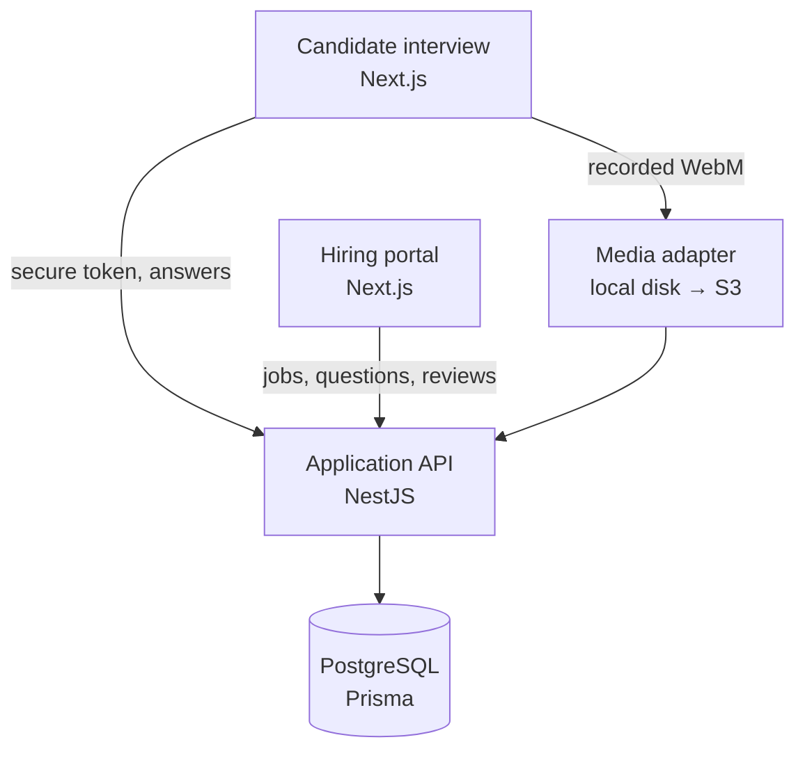

# Architecture

## Design boundaries

- `Job` owns one interview template in this MVP. The schema can later version templates without changing answers or reviews.
- `Question.weight` affects aggregate scores; it does not change an individual reviewer's 0–5 rating scale.
- A collective score first averages all reviewer ratings for a question and then applies that question's weight. This prevents questions with more reviewer votes from receiving accidental extra weight.
- Candidate access is isolated behind invitation tokens and expiry checks.
- Internal authentication is a replaceable guard. The demo guard uses a seeded identity; production should replace it with OIDC/SSO and role authorization.
- `MediaController` is the local-development adapter. Replace it with presigned multipart object-storage uploads before production use.

## Feature modules

| Module | Responsibility |
|---|---|
| `jobs` | Job list/detail, job creation, candidate invitations |
| `interviews` | Question authoring, validation, publishing |
| `candidate` | Token validation, answer autosave endpoint, final submission |
| `media` | Browser recording/file upload adapter |
| `reviews` | Reviewer workspace data, transcript correction, ratings, weighted score |
| `auth` | Current demo identity and future SSO seam |

## Production hardening path

1. Replace demo authentication with company OIDC and server-side RBAC.
2. Hash invite tokens at rest and add token revocation/rotation.
3. Move recordings to private S3/R2 multipart upload; issue short-lived playback URLs.
4. Add a queue worker for transcription, thumbnails, malware scanning, and media normalization.
5. Version published interview templates and add immutable audit events.
6. Add email invitations, retention/deletion jobs, backups, observability, and rate limiting.
