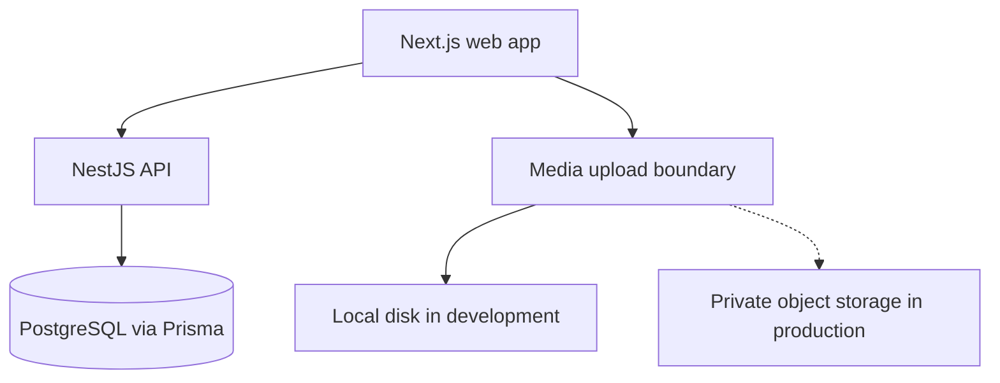

# Development Guide

This application is deliberately structured so the working MVP can grow without rewriting the product.

## Architecture at a glance



## Source ownership

| Path | Responsibility |
|---|---|
| `apps/web/app` | Pages and routing for recruiters, candidates, and reviewers |
| `apps/web/components` | Screen components and browser video recording |
| `apps/web/lib` | API client and frontend types |
| `apps/api/src` | NestJS feature modules and server-side authorization boundary |
| `packages/database/prisma` | Authoritative schema, migrations, and seed data |
| `packages/contracts` | Shared validation and cross-application contracts |
| `docs` | Architecture, setup, scope, operations, and decisions |

## How to add a feature

Use this order for changes that cross the full stack:

1. Write acceptance criteria and identify which role may perform the action.
2. Change the Prisma schema only if persistence is required.
3. Generate and inspect a new migration.
4. Add or update shared contracts.
5. Implement the NestJS service business rules.
6. Expose a controller endpoint and document it in Swagger.
7. Implement the Next.js page/component and explicit loading, empty, and error states.
8. Add unit/integration tests for business rules.
9. Run the complete verification commands.
10. Update product and operational documentation.

## API module pattern

Each business area should have its own module:

```text
apps/api/src/<feature>/
  <feature>.module.ts
  <feature>.controller.ts
  <feature>.service.ts
  dto.ts
```

Controllers should translate HTTP requests and responses. Business rules belong in services. Database access must remain server-side and go through the shared Prisma service.

## Frontend pattern

Prefer route-level server components for initial data and client components only where browser state or APIs are required, such as MediaRecorder, timers, forms, and interactive review controls.

Do not trust frontend role checks. They improve navigation, but every sensitive action must also be authorized in NestJS.

## Database workflow

After changing `packages/database/prisma/schema.prisma`:

```bash
npx prisma format --schema packages/database/prisma/schema.prisma
npx prisma migrate dev \
  --schema packages/database/prisma/schema.prisma \
  --name descriptive_change
npm run db:generate
```

Review the generated SQL before committing it. For production, run `prisma migrate deploy`; never run `migrate dev` against staging or production.

## Reset local demo data

This deletes only the local Docker development database:

```bash
docker compose down
docker compose up -d postgres
npx prisma migrate reset --schema packages/database/prisma/schema.prisma
```

Prisma will ask for confirmation. Do not use reset commands against shared or production databases.

## Verification

```bash
npm test
npm run build
docker compose config
```

For a UI change, also manually test:

- job list and creation;
- interview builder and publish flow;
- candidate invite and submission;
- camera/microphone permission denial;
- refresh during an interview;
- reviewer rating and collective score;
- a narrow/mobile viewport where candidate access is supported.

## Configuration rules

- Add every non-secret variable to `.env.example` with a safe local value.
- Keep actual values in `.env`, which is ignored.
- Use `NEXT_PUBLIC_` only for values safe to reveal to any browser user.
- Validate required server environment variables at application startup before production deployment.

## Architectural decision records

When making a hard-to-reverse decision, add `docs/adr/NNNN-short-title.md` containing status, context, decision, alternatives, and consequences. Appropriate subjects include authentication, object storage, transcription, deployment platform, queue technology, and multi-company tenancy.
